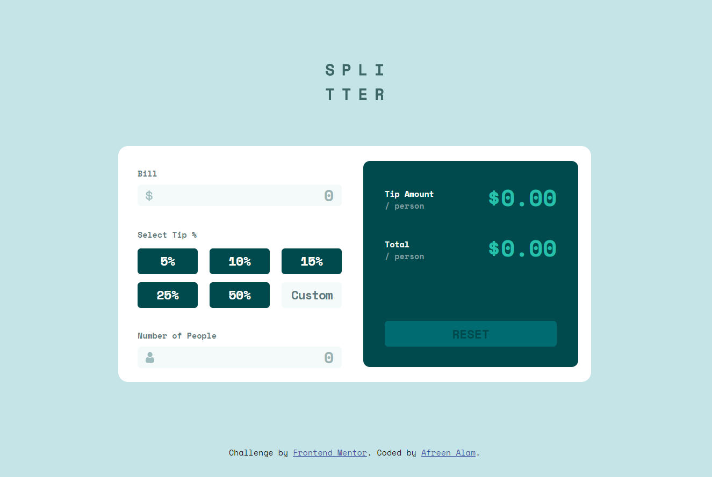

# Frontend Mentor - Tip calculator app solution

This is a solution to the [Tip calculator app challenge on Frontend Mentor](https://www.frontendmentor.io/challenges/tip-calculator-app-ugJNGbJUX). Frontend Mentor challenges help you improve your coding skills by building realistic projects.

## Table of contents

- [Overview](#overview)
  - [The challenge](#the-challenge)
  - [Screenshot](#screenshot)
  - [Links](#links)
- [My process](#my-process)
  - [Built with](#built-with)
  - [What I learned](#what-i-learned)
  - [Continued development](#continued-development)
  - [Useful resources](#useful-resources)
- [Author](#author)


## Overview

### The challenge

Users should be able to:

- View the optimal layout for the app depending on their device's screen size
- See hover states for all interactive elements on the page
- Calculate the correct tip and total cost of the bill per person

### Screenshot




### Links

- Solution URL: [Solution URL here](https://github.com/afreenalam198/tip-calculator-app-main.github.io)
- Live Site URL: [Live site URL](https://afreenalam198.github.io/tip-calculator-app-main.github.io/)

## My process

### Built with

- Semantic HTML5 markup
- CSS 
- Flexbox


### What I learned

Using addEventListeners in scrip instead of onclick or oninput functions in html.

```js
billInput.addEventListener('input', () => {});
```

Using the forEach() function to loop through a group of buttons.

```js
tipBtns.forEach(btn => {});
```

### Continued development

In my future projects I would like to continue to work with more complex Javascript functionalities allowing me to improve my Javascript skills.


### Useful resources

- [w3schools](https://www.w3schools.com/js/default.asp) - This website worked as a good refresher and helped me with figuring out certain Javascript functionalities when I got stuck.


## Author

- Github - [Afreen Alam](https://github.com/afreenalam198)
- Frontend Mentor - [@afreenalam198](https://www.frontendmentor.io/profile/afreenalam198)


